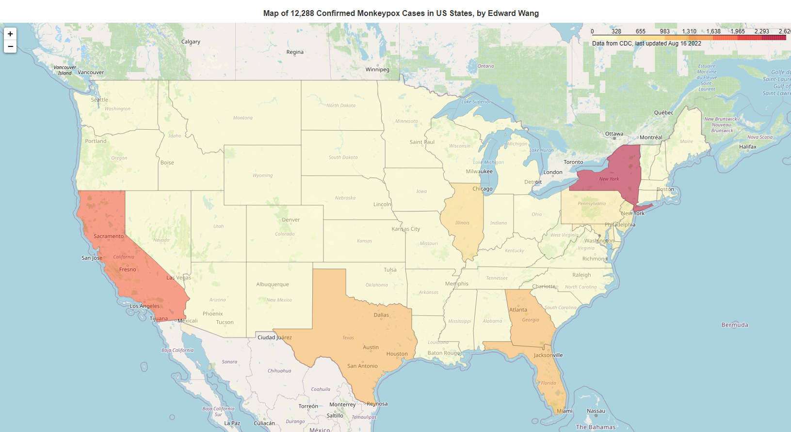

# Monkeypox Map of the US
Utilizes CDC's monkeypox data to create a choropleth map of the confirmed cases in the US

## Description:
This Python application uses BeautifulSoup, Selenium, and RegEx to read the HTML of the [CDC's 2022 US Monkeypox Map](https://www.cdc.gov/poxvirus/monkeypox/response/2022/us-map.html) to retrieve the number of confirmed monkeypox cases for each state. The corresponding data is then mapped using Pandas, Folium, and WebBrowser. This application also uses OS and Platform libraries to assist in Windows/MacOS cross-platform compatibility.



## Table of Contents:
* [Technologies](#technologies)
* [Setup](#setup)
* [Future Ideas](#future-ideas)
* [Credits](#credits)

## Technologies:
* BeautifulSoup version: 4.11.1
* Selenium version: 3.141.0
* Pandas version: 1.4.3
* Folium version: 0.12.1.post1
* ChromeDriver version: 104.0.5112.79

## Setup:
To run this project, install these packages:
```
$ pip install bs4
$ pip install selenium
$ pip install pandas
$ pip install folium
$ pip install lxml
```
Download ChromeDriver for Selenium [here](https://chromedriver.chromium.org/downloads), then add ChromeDriver.exe to PATH as well as the working directory of monkeypox.py.

## Future Ideas:
I hope to implement pop-ups whenever the user hovers over a state to display the confirmed cases of the corresponding state. I also hope to add another layer to the map that displays confirmed cases per capita.

## Credits:
Here are some resources I used to create this project.
### BeautifulSoup and Webscraping:
* https://www.youtube.com/watch?v=XVv6mJpFOb0&t=2760s
* https://stackabuse.com/guide-to-parsing-html-with-beautifulsoup-in-python/
* https://medium.com/geekculture/web-scraping-tables-in-python-using-beautiful-soup-8bbc31c5803e

### Folium:
* https://python-visualization.github.io/folium/quickstart.html

### GeoJSON geometry for the shape of each state
* https://raw.githubusercontent.com/python-visualization/folium/master/examples/data/us-states.json
